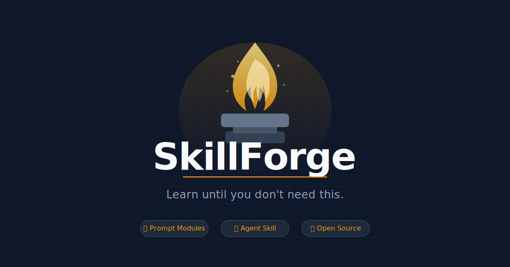

# SkillForge 🔨

<p align="center">
  
</p>

**Not prompts to do things for you — learning paths to make you capable of doing them yourself.**

> Using AI to level up human intelligence, one skill at a time.

[中文版](./README.zh.md) · [Contributing](./CONTRIBUTING.md) · [Skill Tree](./docs/skill-tree.md) · [Philosophy](./docs/philosophy.md)

---

## Why SkillForge?

Most AI prompt collections help you **use AI to get things done**.
SkillForge helps you **become someone who can do those things**.

The difference is fundamental:

| Other prompt collections | SkillForge |
|--------------------------|------------|
| AI does the work for you | AI teaches you to do the work |
| You depend on the prompt forever | You graduate and no longer need it |
| Organized by what AI can do | Organized by what humans want to learn |
| Single prompts | Full learning paths |

Every module in SkillForge has a **graduation condition** — a point at which you should stop using the prompts because you've genuinely internalized the skill.

---

## How It Works

Each skill module contains:

1. **Learning Objectives** — what you'll be able to do after completion
2. **Prerequisites** — what you need to know first
3. **Socratic Prompts** — AI asks questions to guide your thinking, not give you answers
4. **Practice Exercises** — apply the skill with AI feedback
5. **Self-Assessment Rubric** — know exactly where you stand
6. **Graduation Conditions** — when to stop using these prompts

---

## Skill Tree

```
Core Skills
├── Thinking
│   ├── critical-thinking        ← Start here
│   ├── logical-reasoning
│   ├── mental-models
│   └── research-methods
├── Communication
│   ├── writing-clarity
│   ├── persuasive-writing
│   ├── technical-writing
│   └── public-speaking-prep
├── Technical
│   ├── programming-fundamentals
│   ├── debugging-mindset
│   ├── system-design-thinking
│   └── data-literacy
├── Learning
│   ├── how-to-learn
│   ├── note-taking-systems
│   └── knowledge-synthesis
└── Professional
    ├── decision-making
    ├── project-scoping
    └── feedback-giving
```

Full interactive skill tree: [docs/skill-tree.md](./docs/skill-tree.md)

---

## Quick Start

Pick a skill, follow the path, graduate.

**Example: Start with Critical Thinking**

```
skills/critical-thinking/
├── README.md          ← Start here
├── prompts/
│   ├── 01-self-assessment.md
│   ├── 02-identify-assumptions.md
│   ├── 03-steelman-practice.md
│   └── 04-socratic-dialogue.md
└── exercises/
    ├── exercise-01.md
    └── exercise-02.md
```

Open any prompt file, paste it into your preferred AI (Claude, GPT-4, Gemini, etc.), and follow the instructions.

---

## Design Principles

**1. Anti-Dependency**
Every prompt is designed to eventually make itself unnecessary. If you find yourself needing a prompt forever, it's a bug, not a feature.

**2. Socratic over Prescriptive**
We favor prompts that ask you questions over prompts that give you answers. Real learning happens when you think, not when AI thinks for you.

**3. Explicit Mastery Criteria**
Vague goals produce vague learning. Every module defines concrete, observable mastery conditions.

**4. Model-Agnostic**
All prompts work with any major LLM. No vendor lock-in.

---

## Contributing

We welcome contributions in any language.

See [CONTRIBUTING.md](./CONTRIBUTING.md) for:
- How to submit a new skill module
- Quality standards and review process
- Translation guidelines
- The skill module template

---

## Community

- Questions & Discussion: [GitHub Discussions](https://github.com/yourusername/skillforge/discussions)
- Report issues: [GitHub Issues](https://github.com/yourusername/skillforge/issues)
- Skill requests: [Request a Skill](https://github.com/yourusername/skillforge/issues/new?template=skill-request.md)

---

## License

[CC BY 4.0](./LICENSE) — Free to use, share, and adapt with attribution.

---

*SkillForge is a community project. The goal is simple: close the gap between what AI knows and what humans can do.*
